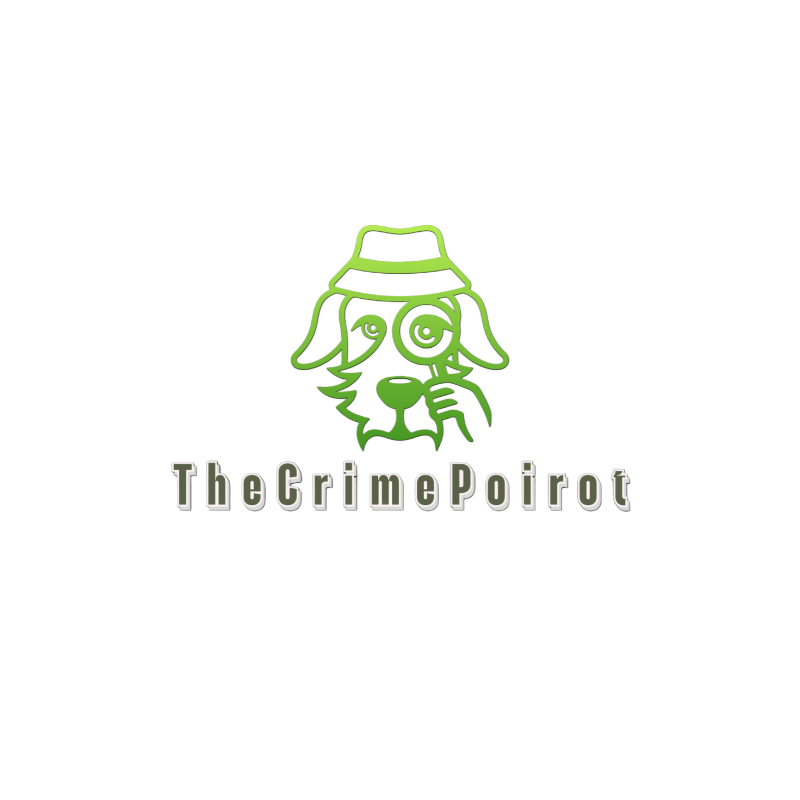

# TheCrimePoirot
## **Introduction**
My work for my diploma thesis _Detection of Vulnerabilities/Malware in Open Source Platforms with Python_.
I used four open source projects from Github:
1. **GitLeaks** : Secret Detection like passwords, API keys, and tokens in git repos, files
2. **GuardDog** : Identification of malicious PyPI and npm packages or Go modules
3. **Safety** : Python dependency vulnerability scanner
4. **Bearer** : Static application security testing (SAST) tool that scans the source code and analyzes the data flows to discover, filter and prioritize security and privacy risks.

## **Main idea behind this project:**
The main idea behind this project was building a tool that can check for various parameters which affect the security trust for a specific repository. After evaluating the findings of Gitleaks, GuardDog, Safety, Bearer for 100 random repositories, we build a csv report which contains the values-findings for all security parameters. In every new repository we decide to scan,we find the percentage of 100 scanned repositories which have values-findings smaller than those of the new repository. According to this percentile, after defining the corresponding weights, a trust score will be calculated. This score will help the owner/ developer to have a quick measure to check about how safe is the repository.

## **How To Use:**
What steps to follow in order to use TheCrimePoirot:
1. `git clone -b dockertest https://github.com/kosmits-ai/TheCrimePoirot.git`
2. Define the `.env`.
3. `docker login`
4. Pull the required Docker images from [DockerHub](https://hub.docker.com/repository/docker/kosmits/thecrimepoirot/general):  
   `docker compose pull`
5. In root directory: `docker compose up`
6. Access the `frontend` service and run your analysis.

###  How to scan repo in frontend:
1. Navigate to Run Scripts tab.
2. Enter a GitHub repository URL.
3. Select which tools you want to run.
4. Based on your choice, you have to define the according weights.
5. Available tools are: Gitleaks, Guarddog, Safety, Bearer.
6. The sum of the corresponding weights must be equal to 1.

### How to re evaluate the trust score criteria?
1. Navigate to the `DB CrimePoirot` tab in frontend.
2. Select `Update DataBase` or `CreateDatabase` depend on your needs.

### How to use runtime runsc?
Using runsc of gVisor is optional.We recommend runsc on tool's services for a better security protection.If you want to run sandboxed containers follow the following:
1. Install gVisor runsc based on the [installation guide](https://gvisor.dev/docs/user_guide/install/).
2. Define static IPs for services in order to communicate with each other.
3. Follow [networking guide from Gvisor](https://gvisor.dev/docs/user_guide/networking/) in `/etc/docker/daemon.json`
4. Define runtimes according to your needs in `docker-compose.yml`. We encourage you to use runsc runtime to tools services and runc in the rest of them for a combination of security and performance.